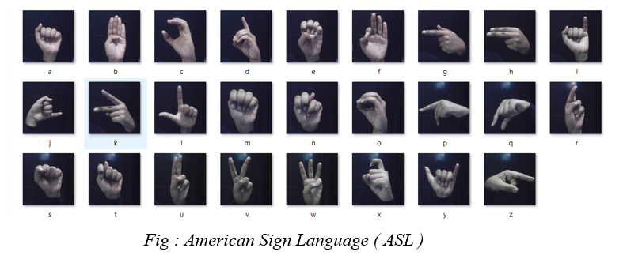

<H1>Virtual Assistant For Mute People</H1>
<H3>It is specially tailored for individuals who are mute, allowing them to communicate using hand sign language in real time. This innovative approach will empower mute individuals to engage with technology efficiently, enhancing their communication and overall quality of life.</H3>
 
