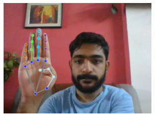
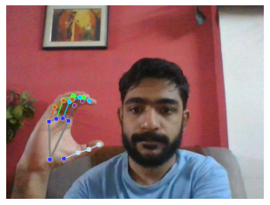
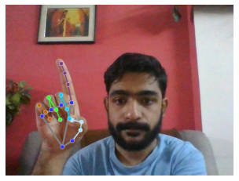
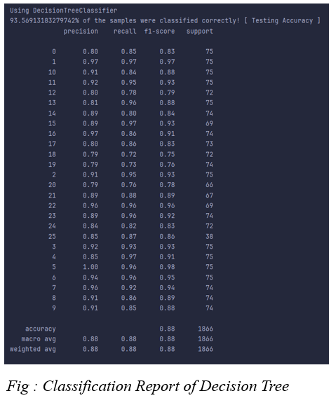
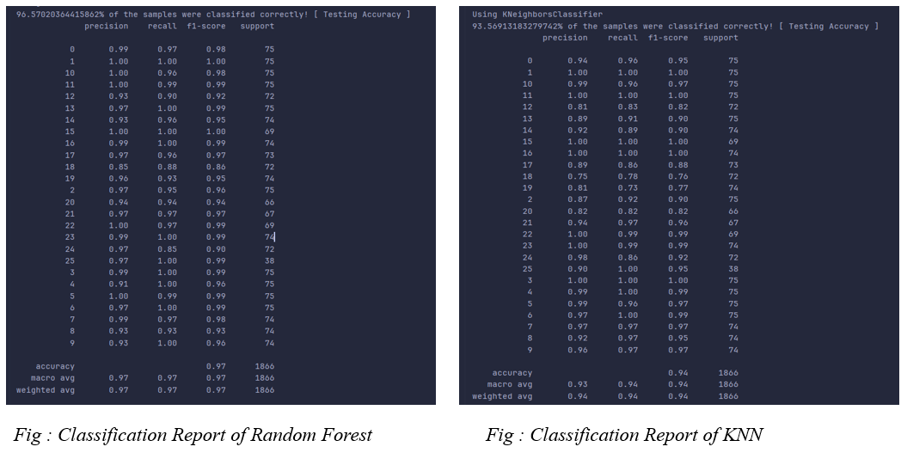

<H1>Virtual Assistant For Mute People</H1>
A Computer Vision and Machine Learning project that captures real-time images of users with the on-device camera using OpenCV 
and detects hand landmarks using MediaPipe. Data vectorization is done with the Numpy library in Python. RandomForest Classifier model
is used to classify the input into alphabets following American Sign Language. Scikit-learn is used for HyperParameter tuning of the model.
Basic commands such as Wikipedia search, YouTube search, web scraping, etc. performed using Wikipedia, YouTubeSearch, and Beautiful Soup libraries.
This empowers mute individuals to perform such basic tasks by simply using hand sign language in a fast and seamless manner.
<h3>Technologies Used</h3>
<ul>
  <li>Python- 3.11.3</li>
  <li>IDE- Visual Studio Code- 1.93.3</li>
  <li>Libraries-</li>
  <ul>
    <li>OpenCV</li>
    <li>MediaPipe</li>
    <li>Numpy</li>
    <li>Scikit-learn</li>
    <li>BeautifulSoup, etc.</li>
  </ul>
</ul>
 

  
  
  

<h3>Classification Reports</h3>

  
  

